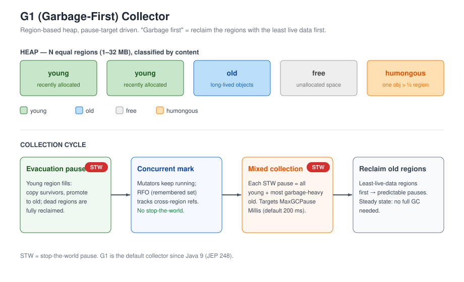
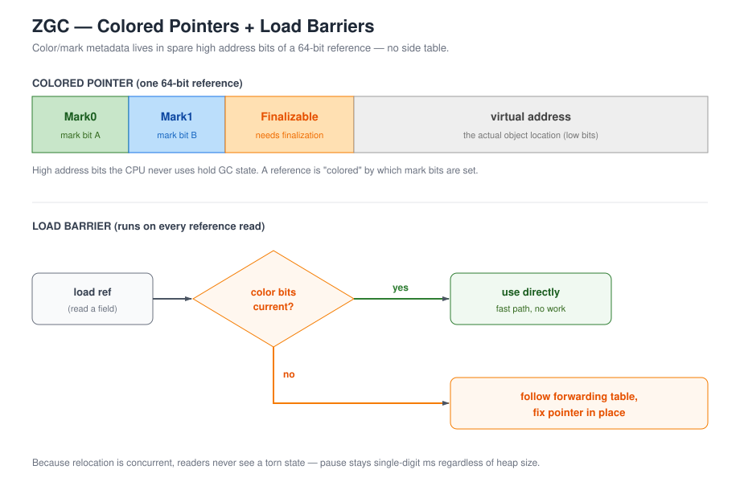

# Java (up to Java 21)

## The core mental model
- Everything is an object on the **heap** (except primitives); you don't manage memory directly - the **GC** does.
- You *do* own: reference semantics, immutability, and thread safety.
- Runs as bytecode on the **JVM**; JIT compiles hot paths to native. "Write once, run anywhere."

## Memory & object model
- **Heap** (objects) vs **stack** (references, local vars, frames) vs statics.
- **`==`** = reference equality; **`.equals()`** = value equality. Always override `equals()` together with `hashCode()` (the contract: equal objects must have equal hashes).
- **GC:** generational (young/old); **G1** is the default since Java 9+; **ZGC / Shenandoah** for low-latency, large heaps.
- Object lifecycle: allocate -> reachable from GC roots -> unreachable -> collected.

## Java Memory Model (JMM) - happens-before
The JMM defines when one thread's writes become **visible** to another. The core guarantee is the **happens-before (hb)** relationship: if action A hb B, then A is visible to B and ordered before it.

**The five fundamental hb edges:**
1. **Program order** - within one thread, earlier actions hb later ones.
2. **Monitor lock** - unlocking a monitor hb any subsequent lock on the same monitor.
3. **`volatile`** - a write to a volatile field hb any later read of that field.
4. **Thread lifecycle** - `start()` hb everything in the started thread; everything in a thread hb its successful `join()`.
5. **Transitivity** - if A hb B and B hb C, then A hb C.

**Also:** writes to `final` fields during construction are safely published (no reordering past the end of the constructor), so other threads see correctly-initialized finals once they get the reference.

**Practical rules:**
- Shared mutable state must be synchronized or use volatile/atomics/immutability.
- **`volatile` gives visibility + ordering, NOT atomicity for compound ops.** `count++` is still a race even if `count` is volatile - use atomics (`AtomicInteger`) or a lock for read-modify-write.

## Garbage collection deep dive
- **Reachability analysis:** an object is collectible when it's not reachable via a chain of references from **GC roots** (live threads, statics, JNI handles, etc.).
- **"Dead but not yet collected":** an unreachable object can still occupy memory until a GC cycle runs. `finalize()` (deprecated) could even resurrect it - never rely on finalization for cleanup; use `try`/`finally`, try-with-resources, or `Cleaner`.
- **Reference types:** strong (default; blocks collection), soft (collected only under memory pressure - good for caches), weak (`WeakHashMap`/`WeakReference`; collected at next GC - e.g., cache keys), phantom (known only via a `ReferenceQueue` after enqueuing - used with a custom handler to track reclamation, e.g., off-heap cleanup).
- **Generational hypothesis:** most objects die young. Young gen (Eden + survivor spaces) is collected often/cheaply (minor GC); survivors get promoted to old gen (major/full GC).
- **Collectors:** **G1** (default since 9+) - region-based, targets `MaxGCPauseMillis`, does mixed collections. **ZGC / Shenandoah** - concurrent, single-digit-ms pauses even on multi-TB heaps; pick for low-latency.
- **Tuning knobs:** `-Xmx`/`-Xms` (heap), `-XX:+UseZGC`, `MaxGCPauseMillis`. Prefer ergonomics first; tune only with a measured problem.
- **What GC does NOT do:** it never collects a live object graph, and it doesn't free native/off-heap memory (use `Cleaner`/`PhantomReference`).

### G1 vs ZGC - how they actually operate

**G1 (Garbage-First): region-based, pause-target driven.** The heap is split into equal-sized **regions** (typically 1-32 MB) - not fixed young/old areas. Each region is classified by its content: **young**, **old**, **humongous** (one object bigger than half a region), or free.



```
G1 heap = N equal regions (1-32 MB), classified by content

  +-------+-------+-------+------+-----------+
  | young | young | old   | free | humongous|
  +-------+-------+-------+------+-----------+
  humongous = one object larger than half a region (gets its own)

G1 collection cycle ("garbage first" = reclaim least-live-data regions first)

  young region fills
      -> [STW] evacuation pause: copy survivors, promote to old,
         dead regions fully reclaimed
      -> concurrent mark: mutators run; RFO tracks cross-region refs
      -> mixed collection (on old-space pressure): each STW pause =
         all young + most garbage-heavy old regions; target
         MaxGCPauseMillis (default 200 ms, not a guarantee)
      -> reclaimed old regions: steady state, no full GC needed
```

**One G1 cycle:**
1. **Evacuation pause (young):** a young region fills -> G1 copies live objects into free space; dead regions are fully reclaimed; survivors get promoted to old regions.
2. **Concurrent mark:** under old-space pressure, G1 marks live objects in the background while mutators keep running (short STW initial mark + cleanup bracket it).
3. **Mixed collections:** repeatedly, each pause evacuates *all* young regions plus a few of the most garbage-heavy old regions, targeting `-XX:MaxGCPauseMillis` (default 200 ms - a target, not a guarantee). Old regions get fully reclaimed, so steady state needs no full GC.
4. **RFO (remembered set):** cross-region references are tracked so evacuation can pick which old regions to include without scanning everything.

Why "garbage first": it collects the regions with the *least* live data first - cheapest bytes per pause, hence predictable pauses.

**ZGC: colored pointers + load barriers.** On a 64-bit JVM there are spare bits in every reference (virtual address space < 64 bits). ZGC stores **mark/color metadata inside the pointer itself** ("colored pointers") instead of a side table.



```
ZGC colored pointer (64-bit JVM): color bits live in spare high address bits

  +-------+-------+-------------+------------------------+
  | Mark0 | Mark1 | Finalizable | virtual address        |
  +-------+-------+-------------+------------------------+
  metadata inside the reference - no side table; CPU never uses these bits

every reference load goes through a barrier:

  load ref --> color bits current?
            yes -> use directly
            no  -> follow forwarding table, fix pointer in place
```

**Operation (nearly all concurrent):**
1. **Concurrent mark:** mutators keep running; a *write barrier* records every reference mutation so marks stay accurate.
2. **Concurrent relocation:** live objects are copied to new locations and a forwarding table is built. On *every* load of a reference, the **load barrier** checks the color bits and transparently redirects stale pointers - readers never see a torn state, and no STW is needed for the copy itself.
3. **Final fixup:** a very short stop-the-world pause (single-digit ms) only to finalize pointer updates; this is why pause times are essentially independent of heap size (hundreds of MB up to 16 TB).

**Generational ZGC (JEP 439, Java 21):** adds an explicit young/old split inside ZGC - collect the young gen first so most collections are short and cheap; old-gen work happens less often. Big throughput win on large heaps.

| | G1 | ZGC |
|--|----|-----|
| Model | Region evacuation toward a pause target | Concurrent mark/relocate via colored pointers |
| Pause behavior | Targeted (`MaxGCPauseMillis`), can slip under load | Independent of heap size, single-digit ms |
| Best for | Most servers (default since 9) | Low-latency / multi-TB heaps |

## Language features & modern additions (8 -> 21)
- **Java 8:** lambdas, **streams API**, `@FunctionalInterface`, `Optional`, default methods in interfaces.
- **Java 9:** modules (JPMS), collection factories (`List.of`, `Map.of`).
- **Java 10:** `var` for local variable type inference.
- **Java 15/16:** text blocks, records, sealed classes, `instanceof` pattern matching.
- **Java 17 (LTS):** sealed types + records matured; strong encapsulation of JDK internals.
- **Java 21 (LTS):** **virtual threads** (final), **pattern matching for `switch`** (final), **record patterns** (final), **sequenced collections**, structured concurrency (preview), string templates (preview), foreign function & memory API (preview).

## Records, sealed types & pattern matching for switch (Java 16-21)
- **Records (final in 16):** an immutable data carrier. The compiler generates the canonical constructor, component accessors, and `equals`/`hashCode`/`toString`. Supports compact constructors, static members, and instance methods; no extra instance fields beyond the components. A modified copy is just a new record built from the existing components (write your own helper); there is **no generated `with()`** - the proposed "wither" (`e with { ... }`, JEP 468) is preview-only and not in any released version.
- **Sealed classes (final in 17):** restrict subtypes - `sealed class Shape permits Circle, Square`. Permitted subtypes must be `final`, `sealed`, or `non-sealed`. This is what makes exhaustive pattern matching possible.
- **Pattern matching for `instanceof` (final in 16):** `if (o instanceof String s) { use s; }` - no cast, null-safe.
- **Switch pattern matching + record patterns (final in 21):**
```java
switch (o) {
    case Integer i -> System.out.println(i);
    case String s when s.length() > 3 -> System.out.println(s); // guarded case
    case Point(int x, int y) -> System.out.println(x + y);       // record pattern
}
```
  - **Exhaustiveness:** over a sealed hierarchy the compiler verifies you cover every permitted subtype, so **no `default` is required**.
  - Record patterns destructure nested data; guards use `when`.


## Threading & Concurrency

**Two models, one API surface.** Java gives you OS-backed **platform threads** (1:1 with a kernel thread) and, since 21, **virtual threads** (M:N, scheduled by the JVM on top of platform "carrier" threads). Everything below works on both; the choice is which to reach for.

### Starting & managing threads
- `Thread` / `Runnable` (void work), `Callable<V>` (returns a value), or submit to an **`ExecutorService`** (`submit`, `invokeAll`). Prefer executors over raw `new Thread()` - you get pooling, shutdown, and task lifecycle.
- Lifecycle states: `NEW -> RUNNABLE -> (BLOCKED | WAITING | TIMED_WAITING) -> TERMINATED`. Know them for debugging ("why is my thread stuck?").
- **Daemon** threads don't stop the JVM from exiting; **priorities** are largely ignored by modern OS schedulers - don't rely on them.

### Synchronization primitives
- **`synchronized`:** a reentrant monitor lock + a happens-before edge on unlock->lock (see JMM above). Can't be interrupted, timed out, or acquired conditionally - and it **pins** virtual threads.
- **`ReentrantLock`:** same mutual exclusion, but adds `tryLock()`, `lockInterruptibly()`, fairness, and **condition variables** (`newCondition()`). Use when you need any of those - or to avoid pinning on virtual threads.
- **`volatile`:** visibility + ordering only; no atomicity for compound ops (see JMM above).
- **Atomics:** `AtomicInteger`, `AtomicReference`, etc. use **CAS** (compare-and-swap) - lock-free, but beware ABA and that a CAS spin isn't free under heavy contention.
- **`AbstractQueuedSynchronizer` (AQS):** the base for `CountDownLatch`, `Semaphore`, `ReentrantLock`, `StampedLock` - understand it to read the rest.

### Coordination & waiting
- **Condition variables** (`await()`/`signal()`) paired with a lock; **`CountDownLatch`** (one-shot), **`CyclicBarrier`** (reusable, n parties meet at a point), **`Semaphore`** (permits), **`Exchanger`**.
- **Interrupts are the cancellation protocol:** check `Thread.interrupted()` / handle `InterruptedException`; never swallow it.

### Thread pools (what you'll actually ship)
- **Why not raw threads:** pooling bounds memory, reuses OS threads, and gives a work queue + rejection policy.
- **`ExecutorService`** = pool + task lifecycle (`submit`, `shutdown`, `awaitTermination`). Sizing: I/O-bound -> ~2× cores (or just use virtual threads); CPU-bound -> ~cores (+1).
- **`ForkJoinPool`:** work-stealing; backs parallel streams. The common pool is shared - don't put blocking calls in it.

### CompletableFuture (async composition)
- Build pipelines: `thenApply`, `thenCompose` (flat), `thenCombine`, `exceptionally`, `whenComplete`.
- Runs on the **common ForkJoinPool** by default (or a supplied executor); start with `supplyAsync`/`runAsync`. Don't block a pool thread waiting on itself - prefer chaining.

### Thread-safe collections
| Type | Notes |
|------|-------|
| `ConcurrentHashMap` | striped/CAS; `compute`, `merge`; weakly consistent iterators |
| `CopyOnWriteArrayList` / `Set` | safe for iteration-heavy, write-rare (listener lists) |
| Blocking queues (`ArrayBlockingQueue`, `LinkedBlockingQueue`) | bounded/unbounded FIFO - the producer-consumer backbone |
| `ConcurrentSkipListMap` | sorted + concurrent |

### Virtual threads (Java 21) - the big one
- **M:N scheduling:** many virtual threads share a small pool of platform "carrier" threads. A blocking I/O call *unmounts* the virtual thread so its carrier can run another - high concurrency without paying for OS-thread memory/stack per task.
- **Use them for I/O-bound, thread-per-request** code (HTTP handlers, DB calls). They make `CompletableFuture`/thread-pool plumbing unnecessary for that pattern.
- **Pinning:** a virtual thread can't unmount while it holds a `synchronized` monitor or is inside certain native/JNI calls - the carrier is stuck with it and other VTs on that carrier stall. Avoid `synchronized` (use `ReentrantLock`) and be aware of JNI/native blocking.
- **Not for CPU-bound work** - you still need ~#cores; virtual threads add no parallelism there.
- **Scoped values / structured concurrency (preview):** group related tasks as one unit so a scope's failure cancels its children - the answer to "how do I not leak background threads?"

### Pitfalls (interview gold)
- **Deadlock:** two+ threads each hold a lock the other needs. Break with consistent lock ordering or `tryLock` + timeout.
- **Livelock / starvation:** threads keep moving but make no progress; unbounded retry without backoff.
- **Lost update:** read-modify-write without atomicity - even on a `volatile` field.
- **Memory visibility bugs:** non-volatile shared writes are invisible across threads (JMM).
- **An uncaught exception kills only that thread** but can silently drop a pool task; use `Future.get()` or an uncaught handler.
- **Don't share mutable state you don't have to** - the cheapest fix is immutability.

## Collections & common APIs
| Collection | Backing | Notes |
|-----------|---------|-------|
| `ArrayList` | dynamic array | fast random access, O(1) get |
| `LinkedList` | doubly-linked list | fast mid insert/remove, poor cache locality |
| `HashMap` / `TreeMap` / `LinkedHashMap` | hash / red-black tree / linked | unordered / sorted / insertion-ordered |
| `HashSet` / `LinkedHashSet` / `TreeSet` | via maps | unique elements |
| Deque / Queue | array/deque | FIFO + both ends |
| concurrent variants | CAS/locks | thread-safe (`ConcurrentHashMap`, etc.) |

**Streams:** intermediate ops are lazy (`filter`, `map`); terminal ops trigger execution (`collect`, `reduce`). Parallel streams help CPU-bound work but not always - beware shared-state bugs and overhead.

## Generics deep dive (type erasure, wildcards, PECS)
- **Type erasure:** generic type info is removed at compile time; the JVM sees raw types. Consequences:
  - Can't create an array or instance of a type variable (`new T[]`, `new T(...)` are illegal) - no runtime type to instantiate.
  - Can't catch/throw a generic exception.
  - All parameterized types erase to their raw form at runtime, so `List<String>` and `List<Integer>` are both just `List` (this is how **heap pollution** sneaks in via raw types).
- **Reifiable vs non-reifiable:** primitives, raw types, and unbounded wildcards are *reifiable* (type info fully available at runtime); a parameterized type like `List<String>` is *non-reifiable* (erased). You can't create an array of a non-reifiable type (`List<String>[]` is illegal) - so a varargs param declared with one (`List<String>...`) is a **heap-pollution** risk; annotate the method `@SafeVarargs`.
- **Wildcards:** `? extends T` = read from it ("produces"); `? super T` = write to it ("consumes"); unbounded `?` = unknown type.
- **PECS** (Producer Extends, Consumer Super):
```java
static <T> void printAll(List<? extends T> src) { for (T t : src) System.out.println(t); } // producer
static <T> void addAll(List<? super T> dst, Iterable<T> it) { for (T t : it) dst.add(t); }  // consumer
```
- **Bounded type parameters:** `class Box<T extends Number & Comparable<?>>`. Avoid raw types (unchecked warnings).

## Streams & functional programming deep dive
- **Two op kinds:** intermediate (lazy, return a stream - `filter`, `map`, `sorted`, `distinct`) vs terminal (trigger execution, return non-stream/void - `collect`, `reduce`, `forEach`, `count`, `anyMatch`). **A stream can only be consumed once.**
- **Stateless vs stateful** intermediate ops: stateless (`map`, `filter`) process element-by-element; stateful (`sorted`, `distinct`, `limit`) need to see (part of) the whole input - costs memory and affects parallelism.
- **Short-circuiting terminals:** `anyMatch`, `allMatch`, `noneMatch`, `findAny` stop early.
- **Collectors:** `toList()`, `toMap()`, `groupingBy`, `partitioningBy`, `joining`, `summingInt`, or custom via `Collector.of`.
- **`reduce`:** the combining function must be associative (and commutative for parallel safety); choose a correct identity element.
- **Parallel streams:** run on the common `ForkJoinPool` (size ~ cores-1). Good for large, CPU-bound data; **bad for small data or anything with shared mutable state / side effects** (race conditions), and often overkill for I/O-bound work. Beware stateful ops under parallelism.
- **Functional interfaces:** `Function`, `Supplier`, `Consumer`, `Predicate`, `BiFunction`; method references (`::`); lambdas.


## OOP & design (interview favorites)
- Encapsulation, inheritance, polymorphism, abstraction; **composition over inheritance**.
- Abstract class vs interface - when to use each (state/ctor vs capability contract).
- SOLID (brief); common patterns: Builder, Factory, Strategy, Observer, Adapter, Decorator - and why Singleton is often a code smell.

## Common interview topics / questions
- `String` vs `StringBuilder` vs `StringBuffer`; why `String` is immutable.
- `==` vs `.equals()`; the `hashCode`/`equals` contract.
- `final` vs `finally` (and deprecated `finalize`).
- Checked vs unchecked exceptions; when to use each; avoid catching `Exception` broadly.
- Generics: **type erasure**, wildcards, PECS (`? extends` for produce, `? super` for consume).
- Fail-fast iterators and `ConcurrentModificationException`.
- Memory model: `volatile`, happens-before, visibility across threads.

## Exceptions & resource management deep dive
- **Checked vs unchecked:** checked exceptions must be handled/declared at compile time (e.g., `IOException`); unchecked are `RuntimeException`/`Error` subclasses and need no declaration. Convention: checked for recoverable conditions the caller can reasonably handle; unchecked for programming errors.
- **Hierarchy:** `Throwable` -> `Error` (JVM-level; don't catch) and `Exception` -> checked + `RuntimeException`.
- **try-with-resources:** auto-closes `AutoCloseable` resources; resources are closed in **reverse declaration order**; any close-time exception is added as a **suppressed** exception to the primary one.
- **Multi-catch:** `catch (A | B e)` where A and B are unrelated (no subclass relationship).
- **Custom exceptions:** extend `Exception`/`RuntimeException`; provide no-arg, message, and cause constructors; preserve the cause when rethrowing.
- **Performance:** exceptions are expensive (stack capture) - never use them for normal control flow.
- **Common pitfalls:** empty catch blocks (swallowing), catching `Exception` too broadly, losing the original exception when rethrowing (keep the chain).


## Gotchas / pitfalls
- **Boxing/unboxing** cost; NPE from unboxing a null `Integer`.
- Object churn in loops (autoboxing, string concatenation) - prefer `StringBuilder`.
- String interning & the string pool; large strings as map keys.
- Deadlocks with nested/overlapping locks.
- **Don't use `synchronized` on virtual threads** (causes pinning).
- Integer overflow and silent wrap-around in arithmetic.

## Self-test questions
1. Why is `String` immutable, and what are the trade-offs?
2. Explain the `equals()`/`hashCode()` contract and why both must be overridden together.
3. What's a virtual thread, when would you use it, and what should you avoid inside one?
4. Records vs a regular class - what do records generate for you?
5. Generics: what is type erasure, and how do wildcards + PECS help?
6. G1 vs ZGC - when would you reach for the low-latency collector?
7. State the five happens-before relationships and what each guarantees.
8. Why isn't `volatile` enough to make `count++` thread-safe?
9. Strong, soft, weak, phantom references - the difference and a use case for each.
10. When does an object become eligible for GC, and why might it still occupy memory after that?
11. How do sealed classes enable exhaustive `switch`, and what replaces `default`?
12. What can't you do because of type erasure (give two concrete examples)?
13. Why are parallel streams sometimes slower or wrong, and when are they a good idea?
14. In try-with-resources, in what order are resources closed, and how are exceptions handled?
15. G1 vs ZGC - how does each decide *what* to collect and *when*, and why is ZGC's pause independent of heap size?
16. What is a "colored pointer" in ZGC, and what job does the load barrier do on every reference read?
17. When would you reach for generational ZGC (JEP 439) over plain ZGC, and why?
18. Virtual threads vs platform threads - when do virtual threads win, and what makes a virtual thread *pin* to its carrier?
19. `synchronized` vs `ReentrantLock` - name three things a lock gives you that a monitor doesn't.
20. Why is an `ExecutorService` preferred over raw `new Thread()`, and how do you size a pool for I/O-bound vs CPU-bound work?

